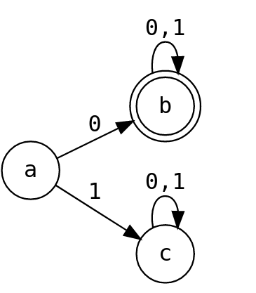

# Finite Deterministic Automata

A command line finite deterministic automata written in python

## How to use?

You are supposed to write a file with rules for your machine following the syntax used in the example document.
I hope the syntax is intuitive and self explanatory.

Before you run main.py, remember to edit the parser.py file to select the name of the file you just created. Or you could just rewrite the example file to suit your needs.

# Example
```
DESCRIPTION = Accept all strings that begin with 0

STATES  ->       "a" "b" "c"

TOKENS  ->      "0" "1"

TRANSITION ->     ["b" "c"]
                  ["b" "b"] 
                  ["c" "c"] 

START_STATE ->   "a"

ACCEPT_STATES ->     "b"
```

